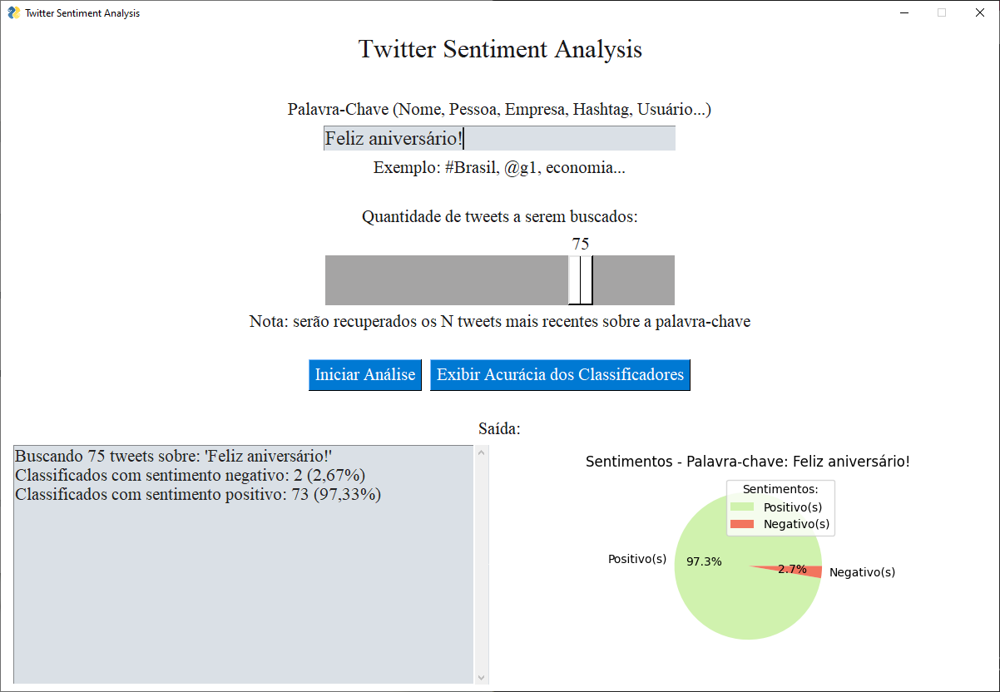

# Tweet Sentiment Analysis



This repo is dedicated to my final paper, where its goal is to develop an application that can collect tweets based on a keyword and then perform sentiment analysis using an ensemble of classifiers to show how many tweets contains negative polarity and how many contains positive polarity.

Note: the interface language is Brazilian Portuguese as in the tweets search code, to use another search language change lang="pt" (in the lang parameter of the tweepy.Cursor located in app/main.py) to lang="en" for example.

## Dependencies
To install required dependencies, go to 'app' folder and run this command:
```bash
pip3 install -r 'requirements.txt'
```

## Database
This project uses a MongoDB database to store the training dataset.
Database name: TweetSentimentAnalysis
Collections:
- NegativeTweets
- PositiveTweets

Collections structure looks like:
```JSON
{
	"tweet": "example tweet text :)"
}
```
To generate the MongoDB container, in the root folder run the command (Docker required):
```bash
docker-compose up
```

## Running
In 'app' folder:
```bash
python main.py
```
It takes a few seconds to train the models before the GUI shows up, you can track the progress in console:
```
Starting application...
Starting classifiers...
Connecting to Twitter's API...
Application started.
```